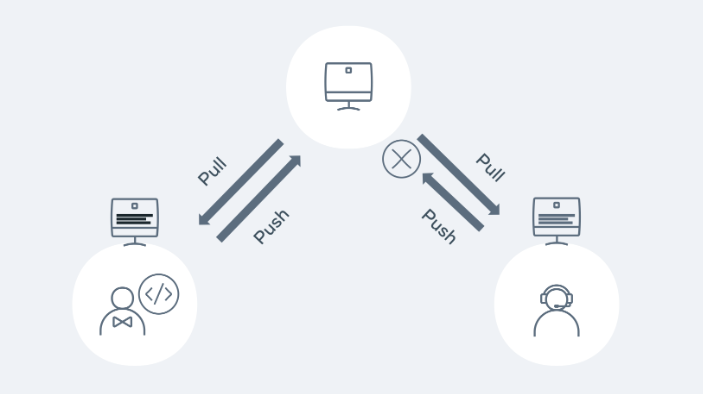

Version Control

    In this course, you will learn about how modern software developers collaborate 
    across the world without messing up each other's code. You will look at the different 
    version control systems and how to create an effective software development workflow. 
    You will be introduced to some of the most commonly used Linux commands that you can 
    use to work with files on your hard drive and create powerful workflows that will 
    automate your work, saving you time and effort. Finally, you will see how Git can be 
    used in software development projects to manage team files, you will create a repository 
    that can manage code revisions.

    After completing this course, you will be able to:
    - Implement Version Control systems.
    - Navigate and configure using the command line.
    - Manage code revisions.
    - Create and use a GitHub repository.
    - The modules and resources that you will work through and explore in this course will
    - help you to prepare for the Exam:
    - Below is an outline of the modules that will be covered in this course:

Module 1: Software Collaboration

    In this module, you will learn about using version control or subversion to bring 
    order to the chaos of massive software projects that have the potential for mistakes 
    and bugs. You will look at the different version control systems and how to create an
    effective software development workflow.
    After completing this module, you will be able to:
    Describe how modern software teams collaborate and work on the same codebase.
    List different version control systems and methodologies.
    Illustrate a standard software development workflow.

Module 2: Command Line

    In this module, you will learn how to use the command line to execute commands in Linux. 
    You will be introduced to some of the most commonly used commands that traverse, create,
    rename, and delete files on your hard drive. You will learn how easy it is to use piping
    and redirection to create powerful workflows that will automate your work, saving you 
    time and effort.
    
    After completing this module, you will be able to:
    - Describe how the command line is and how it is used.
    - Practice traversing your hard drive via the command line.
    - Create, rename and delete files and folders on your hard drive using Unix commands.
    - Use pipes and redirection.

Module 3: Git

    This module will help you to develop a strong conceptual understanding of the Git 
    technology and how it is used in software development projects to manage team files. 
    You will install Git, create a local repository, create a commit, create a remote 
    repository and push commits to a remote repository.

After completing this module, you will be able to: 

    Outline the Git principles.
    Use a GitHub repository.
    Describe the steps in a standard GitHub workflow.
    Create branches and merge different branches and sources.
    Describe how code goes from local development to version control and then to live production.

--------------- Module 4: Graded Assessment ----------->

    In the final module, you'll learn about the graded assessment. After you complete the 
    individual units in this module, you'll synthesize the skills you gained from the course 
    to manage a project on GitHub.
    You'll also have to opportunity to reflect on the course content and the learning 
    path that lies ahead.
    After completing this module, you will be able to:
    Recap on all of the topics covered throughout the course.
    Apply all the skills you have learned in a graded project.

--------------  Practical Exercises ------------------->

    We encourage you to complete the practical exercises in this course. By completing these 
    exercises you will have a more practical understanding of how to explore Version Control.

--------------  Example of version control ------------->

    - Subversion
    - Perforce
    - AWS Code Commit
    - Mercurial
    - Git

----------------- Command Line ---------------------------->

    - cd .., cd ~/Desktop  -> Move to place
    - mkdir                -> To create a new folder - mkdir -p dir2/dir3 p for parent
    - touch index.html     -> Create a  new file
    - code example.js      -> Will open the code in VS Code
    - ls                   -> Show the content of a directory
    - ls -l                -> Read and write permission
    - ls -a                -> Show all file even the hiden one
    - pwd                  -> Print working directory
    - cp                   -> Copy file from A to B
    - mv                   -> move file from A to B   -> mv filename directory/
    - rm                   -> Removing a file or directory
    - cat                  -> Allows reading or concatenation of a file
    - less                 -> display the contents of a file one page at the time
    - grep                 -> Global regular expression, allows for searching content of files
    - man ls               -> Give us information about the command ls
    - cd ~                 -> TO navigate to the home directory
    - .bashrc file         -> Configuration
    - .profile             -> Environment variable
    - Press q              -> key to exit
    - vim file.sh          -> Create a new file -> Enter
    - i                    -> Insert mode
    - #!/bin/bash          -> Telling to the OS that this is a bash class
    - echo "Hello world"
    - chmod 755 test.sh    -> Add the permission to the file
    - wc file.txt -w       -> return the number of word in the file

    - Use pipes | command to run multiple commands
 
    - cat > input.txt - ctr d to stop writting cat < input.txt to output the content
    - grep Sam names.txt -> Will return all name with Sam (Case Sensentive)
    - grep -i Sam names.txt
    - grep -w Sam names.txt // Exactly the name Sam

----------------- Git basic ---------------------------->

    - git init                                -> Initial a git repo
    - git remote add origin https://          -> Add a remote to git repo
    - git status                              -> Checking the status 
    - git commit -m "Message"                 -> Nake a commit 
    - git push -u origin main                 -> Push change to the local repo

----------------- Branches  ---------------------------->

    - git branch                          -> Check the branch
    - git checkout -B 'feature/lesson'    -> Create a new branch
    - git restore --stage test.txt        -> Remove the file from the staging area

    - We can create a brach, work on it and commit it to create a pull request
    - We can then review the pull request and merge to the main branch after satisfaction
    - git pull command pull the latest code from the codebase
    - git remote -v  to see the connection
    - git checkout main

----------------- Resolving conflicts ---------------------------->

    - Conflicts will normally occur when you try to merge a branch that may have 
      competing changes. Git will normally try to automatically merge (auto-merge), 
      but in the case of a conflict it will need some confirmation, the competing changes 
      need to be resolved by the end user. This process is called merging or rebasing. 

    - The developer must look at the changes on the server and the changes on their local
      and validate which changes should be resolved.
 
    - A merge conflict example is when two developers are working on their own dependent branches.
      Both developers are working on the same file called Feature.js. Each of their tasks is to 
      add a new feature to an existing method. Developer 1 has a branch called feature1 and developer 
      2 has a branch called feature2. 

    - Developer 1 pushes the code with the changes to the remote repository. Developer 2 pushes their changes.

    - Let's walk through how this would happen in Git. Both developers 1 and 2 checkout the main repository on Monday 
      morning. They both have the exact same copy. Both developers checkout a new branch - feature 1 and 2.

    ---------------------------------------------------
    Developer 1
    - git pull
    - git checkout -b feature1

    Developer 2
    - git pull
    - git checkout -b feature1

    ---------------------------------------------------

    - Developer 1 makes their changes to a file called Feature.js and then commits the 
      changes to the repository   for approval via a PR (pull request)

    ---------------------------------------------------
    - git add Feature.js
    - git commit -m 'chore: added feature 1!!'
    - git pull origin main
    - git push -u origin feature1
    
    - The PR is reviewed and then merged into the main branch. Meanwhile Developer 2 is starting 
      to code on his feature. Again, they go through the same process as Developer 1:

    ---------------------------------------------------

    - Automatic merge failed; fix conflicts and then commit the result.

    - Git lets us know that a merge conflict has occurred and needs to be fixed before it can 
      be pushed to the remote repo. Running git status will also give us the same level of detail:

    ---------------------------------------------------
 
    git status
    On branch feature2
    You have unmerged paths.
    (fix conflicts and run "git commit")
    (use "git merge --abort" to abort the merge)
    
    Unmerged paths:
    (use "git add <file>..." to mark resolution)
    both modified:   Feature.js
    
    no changes added to commit (use "git add" and/or "git commit -a")

    ---------------------------------------------------

    - In order to merge, Developer 2 needs to see and compare the changes from Developer 1.
      It is good practice to first see what branch is causing the merge issue. Developer 1 
      runs the following command:

    ---------------------------------------------------

    git log --merge
    
    commit 79bca730b68e5045b38b96bec35ad374f44fe4e3 (HEAD -> feature2)
    Author: Developer 2
    <developer2@demo.com>
    Date:   Sat Jan 29 16:55:40 2022 +0000
    
        chore: add feature 2
    
    commit 678b0648107b7c53e90682f2eb8103c59f3cb0c0
    Author: Developer 1
    <developer1@demo.com>
    Date:   Sat Jan 29 16:53:40 2022 +0000

    chore: add feature 1

    ---------------------------------------------------

    - We can see from the above that the team conflicting changes occurred in 
      feature 1 and 2 branches. Developer 1 now wants to see the change that 
      is causing the conflict.

    ---------------------------------------------------

    git diff

    diff --cc Feature.js
    index 1b1136f,c3be92f..0000000
    --- a/Feature.js
    +++ b/Feature.js
    @@@ -1,4 -1,4 +1,8 @@@
    let add = (a, b) => {
    ++<<<<<<< HEAD
    +  if(a + b > 10) { return 'way too much'}
    ++=======
    +   if(a + b > 10){ return 'too much' }
      ++>>>>>>> d3b3cc0d9b6b084eef3e0afe111adf9fe612898e
      return a + b;
    }

    ---------------------------------------------------

    - The only difference is the wording in the return statement. Developer 1 added 
      'too much' but Developer 2 added 'way too much. Everything else is identical so 
      in terms of merging and it's a pretty easy fix. Git will show arrows <<< >>> to 
      signify the changes. Developer 1 removes the markers so the code is ready for 
      being submitted:

    ---------------------------------------------------

    let add = (a, b) => {
    if(a + b > 10) { return 'way too much'}
    return a + b;
    }

    ---------------------------------------------------

    git add Feature.js
    git commit -m 'fix merge conflicts'
    git push -u origin feature2
   
    ---------------------------------------------------

    - Developer 2 has now fixed a merge conflict and can create their PR to get 
      the code merged into the main line.

    NB: This is a complete conflict resolution scenario.